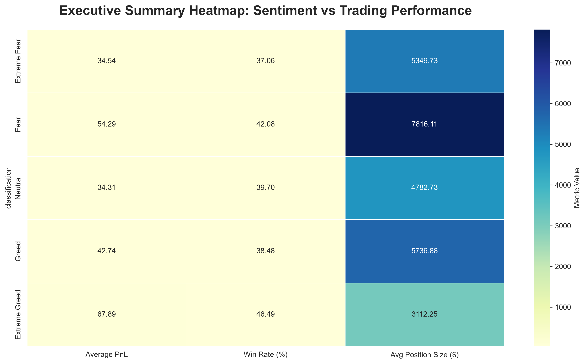

# Bitcoin Market Sentiment vs Trader Performance Analysis

## Project Overview

This project analyzes the relationship between Bitcoin market sentiment and trader performance using the Bitcoin Fear & Greed Index and Hyperliquid historical trading data.

The objective is to understand how different market sentiment conditions influence trading profitability, win rates, position sizing behavior, trading activity, and asset-level performance.

The analysis combines sentiment data with over **211,000 trading records** and uncovers actionable insights that can support sentiment-aware trading strategies.

---

## Datasets Used

### 1. Bitcoin Fear & Greed Index

The dataset provides daily market sentiment classifications:

- Extreme Fear
- Fear
- Neutral
- Greed
- Extreme Greed

### 2. Hyperliquid Historical Trading Data

The dataset contains:

- Account Information
- Coin Traded
- Execution Price
- Position Size
- Trade Direction
- Closed PnL
- Trade Timestamps

Total Records Analyzed: **211,224**

---

## Methodology

### Data Preparation

- Loaded Bitcoin Fear & Greed Index data
- Loaded Hyperliquid trading data
- Converted timestamps into a common date format
- Merged datasets using trade date

### Feature Engineering

The following analytical features were created:

- **Win Trade Indicator** – identifies profitable trades
- **Realized Trade Dataset** – contains only non-zero PnL trades for validation analysis

### Exploratory Data Analysis

The merged dataset was analyzed to evaluate:

- Trading activity
- Profitability
- Win rates
- Position sizing behavior
- Buy/Sell patterns
- Asset-level performance

### Validation Analysis

Since more than 50% of trades reported zero realized PnL, a secondary analysis was performed using only non-zero PnL trades to validate the robustness of profitability findings.

---

## Key Findings

### Extreme Greed Produced The Highest Trading Efficiency

- Highest average profitability
- Highest realized profitability
- Highest win rate

### Fear Generated The Largest Total Profit

- Highest cumulative profitability
- Largest average position sizes
- Highest trading activity

### Trading Behavior Changes With Sentiment

- Sell-side activity increased during Greed and Extreme Greed
- Larger capital deployment occurred during Fear periods

### Zero-PnL Trades Represented 50.57% Of The Dataset

A validation analysis using only realized-profit trades confirmed that the primary findings remained consistent.

---

## Visualizations

The project includes 10 analytical visualizations:

1. Trade Count by Sentiment
2. Average PnL by Sentiment
3. Realized PnL Analysis
4. Total Profit by Sentiment
5. Win Rate Analysis
6. Position Size Analysis
7. PnL Distribution Analysis
8. Buy vs Sell Behavior Analysis
9. Top Performing Assets
10. Executive Summary Heatmap

---

## Business Recommendations

- Incorporate market sentiment indicators into trading strategies.
- Monitor Extreme Greed conditions for momentum-driven opportunities.
- Utilize Fear periods for accumulation and capital deployment.
- Apply stronger risk management during Extreme Fear conditions.
- Focus on high-performing assets that consistently generate profitability.
- Evaluate trading performance using realized-profit metrics.

---

## Limitations

- The analysis identifies correlation rather than causation.
- Trader-specific characteristics were not analyzed separately.
- External market variables such as volatility and macroeconomic events were not included.
- Historical performance does not guarantee future results.

---

## Technologies Used

- Python
- Pandas
- NumPy
- Matplotlib
- Seaborn
- Jupyter Notebook

---
## Executive Summary Dashboard

## Author

**Prasanna B**

Data Analysis Internship Assignment – PrimeTrade.ai
